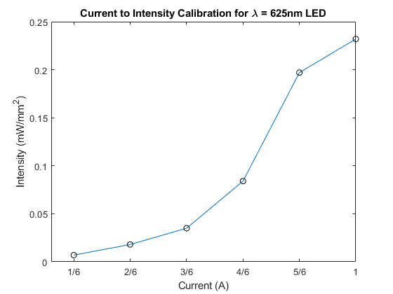

# Conversion Notes for the Cohen Lab Data

The current structure of the shared data is the following. Each bullet point is a folder containing different type of data:


* Chronic Silencing and Mechanical Perturbation Data (Empty)
* Confocal images (this contains a czi file for the confocal images)
* example datasets (old shared data that is incomplete, it does not have a movie that corresponds to the a row on the matlab structure)
* Free Flight Optogenetics Data (This contains the data we are working with)
* Optogenetics and Mechanical Perturbation Data (Empty)

A similar experiment can be found in:

> Whitehead, Samuel C., et al. "Neuromuscular embodiment of feedback control elements in Drosophila flight." Science Advances 8.50 (2022): eabo7461.

## Questions
* How to align the mp4 movies with the data in the matlab files? My understanding is that they take the data from the phantom camera which records only when the flies are in view. The phantom camera is at 8000 fps and the videos are 30 fps but there are around 2301 frames in the videos and 401 timestamps in the matlab files. The timestamps cover a range from -10 milliseconds to around 50 milliseconds (so 50 milliseconds total) whereas the videos last like 1 minutes and and seventeen seconds.

If they really store all the frames of the phantom in the videos, that means that the duration between frames is 1 / 8000 ~ 0.125 milliseconds. So, the 2301 frames in the video should be around 287 milliseconds. The range on the matlab files is 60 milliseconds so the videos are longer.

Answer after the meeting on the 17 of February:
They have a detection mechanism that uses two lasers that intersect at the middle and photodiodes.
This allows them to trigger camera recording when the fly is in the middle of the intersection of the lasers.

The camera frames goes from -500 to 1800 frames. The data on the matlab structure sometimes does not correspond to all the data on the video, so sometimes the start is trimmed. That means that the video starts before the data. They will add the frame of the video that corresponds to the first timestamps (the `t` on the data structure) to each of the rows.


* What is the location of the stimulation? 
They will send it
* Why is the unit milliwatt per square millimeters?
This is more useful. See discussion here:
https://github.com/NeurodataWithoutBorders/nwb-schema/issues/609

* Is the stimuli constant in the other experiments?
Yes. Within an experiment it is constant.
* Are you gona have imaging series data on other experiments?
No, only the confocal data.
* What do you use the confocal image for?
For immunohistochemistry. See the paper reference at the top. Basically, they use it to confirm that the optogenetic protocol worked. This should be a single image in a single nwbfile.

## Free Flight Optogenetics Data

```
Command: 	 tree -shL 3 
[4.0K]  .
├── [4.0K]  SS40851  UAS-CsChrimson
│   ├── [4.0K]  0.67A Opto Activation
│   │   ├── [4.0K]  mp4
│   │   └── [230K]  SS40851_0_67A_activation.mat
│   └── [4.0K]  1A Opto Activation
│       ├── [4.0K]  mp4
│       └── [460K]  SS40851_1A_activation.mat
└── [4.0K]  SS40851  UAS-GtACR1
    ├── [4.0K]  0.67A Opto Silencing
    │   ├── [4.0K]  mp4
    │   └── [713K]  SS40851_0_67A_silencing.mat
    └── [4.0K]  1A Opto Silencing
        ├── [4.0K]  mp4
        └── [344K]  SS40851_1A_silencing.mat

```

Where `SS40851` looks like a driver . Then

Those look like effectors:
* Uas-CsChrimson: A red-shifted channelrhodopsin that activates neurons when exposed to red light.
* UAS-GtACR1: An anion-conducting channelrhodopsin that silences neurons when exposed to light.

`1A` and `0.67A` look lke the intensity of the light.

There is a matlab structure for each experiment and the corresponding videos it seems.

### Matlab struct

The columns of the matlab struct are:

* **effector**: Effector line used (see genotype_information.txt for full genotype)
* **driver**: Driver line used
* **ExprDate**: Day experiment was performed in DDMMYYY format.
* **ExprNum**: Experiment number
* **MovNum**: Movie number
* **t**: time points in seconds
* **wingL**: Matrix containing all 3 left wing angles. Row1 = stroke, row2 = deviation, row3 = pitch.
* **wingR**: Matrix containing all 3 right wing angles. Row1 = stroke, row2 = deviation, row3 = pitch.
* **bodyPitch**: body pitch angles
* **bodyRoll**: body roll angles
* **bodyYaw**: body yaw angles
* **optoStimRange**: 2 element array containing the start and end times of the optogenetic stimulation.
* **frameNum** The frame number is essentially the time multiplied by the frame rate. I think this is the time 

The title of each .mat file contains information about the type of perturbation in the following format:
driver_stimulusType_intensity_duration

For example, SS40851_Activation_1A_50ms means that the .mat file contains optogenetic activation data with the SS40851 driver line with 1A of current driving the LED and a 50ms duration. Other .mat files will contain experiments with silencing, and also at different LED intensities.

This is for the file `'SS40851_Activation_1A_50ms.mat'`:

|    | effector       | driver   |   ExprDate |   MovNum | OptoStimRange   |   optoIntensity |
|---:|:---------------|:---------|-----------:|---------:|:----------------|----------------:|
|  0 | UAS-CsChrimson | SS40851  |   05042023 |        1 | [0.   0.05]     |            0.67 |
|  1 | UAS-CsChrimson | SS40851  |   05042023 |        3 | [0.   0.05]     |            0.67 |
|  2 | UAS-CsChrimson | SS40851  |   05042023 |       14 | [0.   0.05]     |            0.67 |
|  3 | UAS-CsChrimson | SS40851  |   05042023 |       15 | [0.   0.05]     |            0.67 |
|  4 | UAS-CsChrimson | SS40851  |   05042023 |       20 | [0.   0.05]     |            0.67 |


The LED intensities are controlled by changing the amount of current that is driving the LED. The maximum current is set at 1A. The red LED for activation experiments (wavelength of 625nm) current to intensity curve is plotted in LED_calibration_curve.png.



The table of the intensities is here:

```
| Current | Intensity |
|---------|-----------|
| 1/6     | 0.007     |
| 2/6     | 0.018     |
| 3/6     | 0.035     |
| 4/6     | 0.084     |
| 5/6     | 0.197     |
| 6/6     | 0.232     |
```

#### Questions

### mp4 movies
Some metadata for two of the videos:

```
Command: 	 ffprobe -v error -select_streams v:0 -count_frames -show_entries stream=nb_read_frames,duration,r_frame_rate,avg_frame_rate -of default=nokey=1:noprint_wrappers=1 Expr_43_movie_001.mp4 
30/1
34515000/1150499
76.699900 (1 minutes and 17 seconds)
2301 (number of frames)

Command: 	 ffprobe -v error -select_streams v:0 -count_frames -show_entries stream=nb_read_frames,duration,r_frame_rate,avg_frame_rate -of default=nokey=1:noprint_wrappers=1 Expr_43_movie_003.mp4  
30/1
34515000/1150499
76.699900 (1 minutes and 17 seconds)
2301 (number of frames)
```

Now, the question is to which interval of the experiment they belong to?


The movies have 2301 frames

But the mat files indicate 401 timestamps per movie, what gives?

#### Notes about matching video and rows form the matlab struct

From the authors:

| The included video is just an example of what our raw data looks like. Our raw data is saved as a .cine file, which is a proprietary file format from Phantom, the high speed camera company. The cine files are uncompressed and can only be viewed with software from Phantom, so we stitch together the different camera views in MATLAB and convert everything to an mp4 for easy viewing. Do you think adding the .mp4 videos are necessary? Each video has an experiment and movie number associated with it, so I could add that to the .mat file to link it to a specific mp4. 

The range of data shown in the .mat file only includes the moments when the fly is fully in view in all camera views which will be different for each video. Otherwise, the reconstruction algorithm that we use to extract the wing and body angles will not work. We usually only use data from -20ms to 50ms for analysis, so in the future I can organize the data and not include data from outside of that range if that's preferable. 


## Confocal Data

This can be propably read with:
https://www.zeiss.com/microscopy/us/products/software/zeiss-zen/czi-image-file-format.html

The github repo contains examples files and notebooks on how to read this:
https://github.com/ZEISS/pylibczirw/tree/main

The specification is here:

https://zeiss.github.io/pylibczirw/

Another library:
https://pypi.org/project/czifile/

https://github.com/cgohlke/czifile/blob/master/czifile/czifile.py

The latter library is pip installable by the same creator of the tifffile library.

Some analysis code:

```python

from pathlib import Path

folder_path = Path("/home/heberto/cohen_project/Sample data/Cohen Lab/Confocal images")
assert folder_path.is_dir()

file_path = folder_path / "tp1-alt_VNC2.czi"
assert file_path

import czifile

czi_reader = czifile.CziFile(file_path)
metadata = czi_reader.metadata()

print(f"Shape: {czi_reader.shape}")  # Data dimensions
print(f"Axes: {czi_reader.axes}")  # Axis order

Shape: (1, 1, 2, 1, 209, 1949, 1024, 1)
Axes: BVCTZYX0

image_data = czi_reader.asarray()
print(f"Image shape: {image_data.shape}")
```
Where

| Axis | Meaning                                                                                       |
|------|-----------------------------------------------------------------------------------------------|
| B    | Block – Used for tiled/mosaic images or multi-scene files. If 1, there is only one block.     |
| V    | View – Related to multi-view imaging. Typically 1 for single-view data.                       |
| C    | Channel – Number of channels in the image.                                                    |
| T    | Time – Number of time points (for time-lapse imaging).                                        |
| Z    | Z-Depth – Number of focal planes (for z-stacks). Your file has 209, indicating a 3D stack with 209 slices. |
| Y    | Height – The number of pixels along the Y-axis (1949 pixels).                                 |
| X    | Width – The number of pixels along the X-axis (1024 pixels).                                  |
| 0    | Sample – Often used for multi-sample imaging, e.g., RGB or multi-spectral imaging. If 1, this means single-sample intensity values (grayscale or monochrome). |


The whole metadata can be extracted with the following script

```python
from pathlib import Path
import czifile
import xml.etree.ElementTree as ET

folder_path = Path("/home/heberto/cohen_project/Sample data/Cohen Lab/Confocal images")
assert folder_path.is_dir()

file_path = folder_path / "tp1-alt_VNC2.czi"
assert file_path

czi_reader = czifile.CziFile(file_path)
metadata_json = czi_reader.metadata(raw=False)


image_data = czi_reader.asarray()
print(f"Shape: {czi_reader.shape}")  # Data dimensions
print(f"Axes: {czi_reader.axes}")  # Axis order

format_metadata = metadata_json["ImageDocument"]["Metadata"]
image_metadata = format_metadata["Information"]["Image"]
scaling_metadata = format_metadata["Scaling"]
devices_metadata = format_metadata["Instrument"]
microscopes_metadata = devices_metadata["Microscopes"]
light_sources_metadata = devices_metadata["LightSources"]
detectos_metadata = devices_metadata["Detectors"]
objectives_metadata = devices_metadata["Objectives"]
fileters_metadata = devices_metadata["Filters"]


coordinate_to_scale = dict()
for distance_time in scaling_metadata["Items"]["Distance"]:
    coordinate_to_scale[distance_time["Id"]] = distance_time["Value"]
    
coordinate_to_scale
```

Example of some of the metadata in the structure, you can check the contents on the repo under assets `confocal_metadata.json`:

```
File Name: tp1-alt_VNC2
User: ht452
Creation Date: 2024-08-01
Microscope: Zeiss LSM 880, Axio Examiner
Image Type: 16-bit grayscale
Bit Depth: 12 bits per sample
Image Size: 1024 x 1949 pixels (XY)
Z-Stack: 209 slices
Channels: 2
Objective: W Plan-Apochromat 20x/1.0 DIC (Water, NA=1.0)
Refractive Index: 1.333 (water)

Channel	Fluorophore	Excitation (nm)	Emission (nm)	Pinhole (Airy Units)	Detector Gain
Ch1	Alexa Fluor 488	488 nm	560.5 nm	0.7684	600
Ch2	Alexa Fluor 633	633 nm	692.5 nm	0.6220	774
```

## Subject

From the Readme:
All flies used for experiments are female, approximately 3-5 days old.

### Genotypes

Genotypes of flies are listed below.

Stock used

UAS-CsChrimson (effector):
20XUAS-CsChrimson-mVenus (attP18)

SS40851 (driver):
VT016988-p65ADZp (attP40); R39E01-ZpGDBD (attP2)/TM6B

Full genotypes of flies

SS40851>UAS-CsChrimson:
20XUAS-CsChrimson-mVenus (attP18)/+ ; VT016988-p65ADZp (attP40)/+ ; R39E01-ZpGDBD (attP2)/+