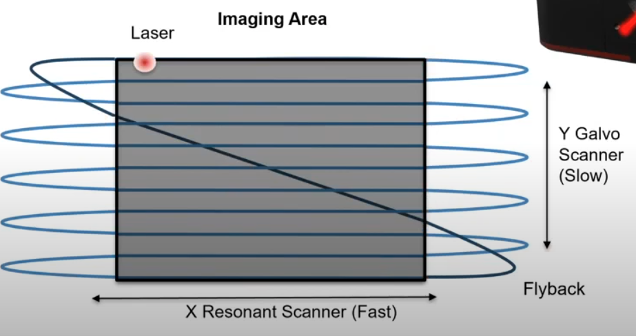

# Conversion notes

## Questions
* What is the `ROIMask.raw` data for? 
These are used to track ROIs but accordingo to Eivind and to Payel (the contact person of the Dickerson lab) these modality is seldom used so we will be ignoring this data for now.
* Are the two channels acquired simultaneously or interleaved?
* What about the apparent copies of the tiff files on the experiments:

```
ChanA_001_001_001_239(1).tif
on:
/Sample_trial/Sample_1/sample
```

* Which channel corresponds to which fluorophore? Tdtomato and GCamp
* What Microscope is being used? What is the name of the device?
Bergamo

## Description in the the docs File

```
Data type: 2-photon stack of TIFF images 
Size of each trial: ~900 MB
Total expected data size: ~90 GB
Description of folder: Each folder has two sub-folders. The sample subfolder has the stack of TIFF images. It has data from two channels – Tdtomato and GCamp. The other subfolder has data from Thorsync (used for syncing visual stimulus, wing-beat analyzer, and imaging session). 
```

## Flourophores

```
tdTomato (a red fluorescent protein)
Excitation peak (λ_ex): ~554 nm
Emission peak (λ_em): ~581 nm
GCaMP (a calcium indicator based on GFP)
Excitation peak (λ_ex): ~480 nm
Emission peak (λ_em): ~510 nm
```

## Thor Format

I believe the files were produced with the ThorImage®LS device. From the specification on its [corresponding website](https://www.thorlabs.com/newgrouppage9.cfm?objectgroup_id=9072#ad-image-0):

```
Images Stored as 16-Bit TIFFs
Image Calibration Values Stored in TIFF Metadata
OME-TIFF Header Support for Multi-Image Experiments
Additional Instrument and Experiment Info Stored in Open XML Format
ROI Statistics Stored in HDF5 Data File
```

What is Open XML Format?
I think this just a way of refering to the fact that the XML format is open. The Thor format uses an XML format to store metadata: [example](./assets/thor_experiment.xml) 


Moreover, the tiff files have ome metadata embeeded, here is a example of the metadata in the tiff files:

```xml

<?xml version='1.0' encoding='utf-8'?>
<ns0:OME xmlns:ns0="http://www.openmicroscopy.org/Schemas/OME/2010-06"
    xmlns:ns2="http://www.openmicroscopy.org/Schemas/BinaryFile/2010-06"
    xmlns:ns3="http://www.openmicroscopy.org/Schemas/SA/2010-06"
    xmlns:xsi="http://www.w3.org/2001/XMLSchema-instance"
    xsi:schemaLocation="http://www.openmicroscopy.org/Schemas/OME/2010-06 http://www.openmicroscopy.org/Schemas/OME/2010-06/ome.xsd">
    <ns0:Image ID="Image:0" AcquiredDate="2024-05-06T17:55:12.769-00:00">
        <ns0:Pixels DimensionOrder="XYCZT" ID="Pixels:0" PhysicalSizeX="1.303" PhysicalSizeY="1.303"
            PhysicalSizeZ="1" SizeC="2" SizeT="1000" SizeX="256" SizeY="256" SizeZ="1"
            TimeIncrement="0" Type="uint16">
            <ns0:Channel ID="Channel:0:0" SamplesPerPixel="1">
                <ns0:LightPath />
            </ns0:Channel>
            <ns2:BinData BigEndian="false" Length="0" />
            <ns0:Plane DeltaT="0" TheC="0" TheZ="0" TheT="0" />
            <ns0:TiffData FirstT="0" FirstZ="0" FirstC="0">
                <ns0:UUID FileName="ChanA_001_001_001_001.tif">
                    urn:uuid:E956140B-D693-4175-A556-94CC2C596508</ns0:UUID>
            </ns0:TiffData>
            <ns0:TiffData FirstT="0" FirstZ="0" FirstC="1">
                <ns0:UUID FileName="ChanB_001_001_001_001.tif">
                    urn:uuid:A86E52DD-ADDF-49C7-828A-30BF642D8641</ns0:UUID>
            </ns0:TiffData>
            <ns0:TiffData FirstT="1" FirstZ="0" FirstC="0">
                <ns0:UUID FileName="ChanA_001_001_001_002.tif">
                    urn:uuid:5B9F1667-2700-4DDD-B2CC-FE14D58E82D1</ns0:UUID>
            </ns0:TiffData>
            <ns0:TiffData FirstT="1" FirstZ="0" FirstC="1">

...
Truncated
```

This code can be obtained by running the folhttps://www.swabianinstruments.com/static/documentation/TimeTagger/tutorials/ConfocalMicroscope.htmllowing code:

```python
import tifffile as tf

with tf.TiffFile("ChanA_001_001_001_001.tif") as tif:
    print(tif.ome_metadata)  # Notes this is the xml metadata embedded as a string
```

Scanner pattern:




## HDF5 File

- **LeftWingBeatAmplitude and LeftMinusRightWingbeatAmplitude**: Analog output signals from WBA_independent (a MATLAB program that detects these parameters) fed to Thorsync using a breakout box.
- **Visual Stimulus 1**: Analog output from the controller of the visual arena feeding information about the pattern/bar movement in the X-direction to Thorsync using the same breakout box.
- **Visual Stimulus 2**: Same as Visual Stimulus 1, but in Y-direction.
- **FrameCounter**: Time-stamps at which the frames are recorded (Frames are recorded at 4 Hz).

They are accessible in the HDF5 file under the following paths:

```python

f = h5py.File(file_path, 'r')
f.keys()
<KeysViewHDF5 ['AI', 'CI', 'DI', 'Freq', 'Global']>

f["Global"]["GCtr"].shape
((3000, 1), (3000, 1))

frame_out = f["DI"]["FrameOut"]
line_out = f["DI"]["LineOut"]

frame_out.shape, line_out.shape
((8472000, 1), (8472000, 1))

frame_counter = f["CI"]["FrameCounter"]    
frame_counter
<HDF5 dataset "FrameCounter": shape (8472000, 1), type "<u4">

left_minus_right_wing_beat = f["AI"]['LeftMinusRightWingBeatAmpltude']
left_wing_beat_amplitude = f["AI"]['LeftWingBeatAmplitude']
visual_stimulus1 = f["AI"]['VisualStimulus1']
visual_stimulus2 = f["AI"]['VisualStimulus2']

left_minus_right_wing_beat.shape, left_wing_beat_amplitude.shape, visual_stimulus1.shape, visual_stimulus2.shape

((8472000, 1), (8472000, 1), (8472000, 1), (8472000, 1))

```
## Subject Information

```
Species: Drosophila melanogaster
Age: 3 days old
Sex: Female 
Genotype: UAS-GCamp7f/TdTomato x Gal4-R22H05 
```

