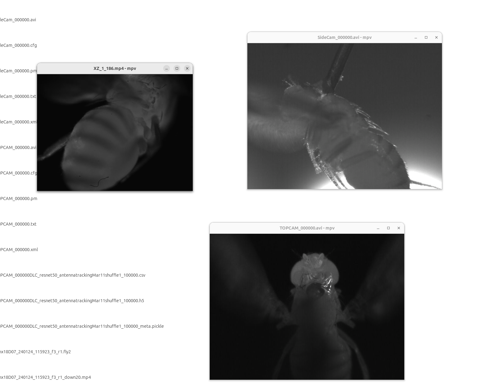

# General comments
Point-person: Amy Streets (axs2909@case.edu) and Kris Lea (kxl786@case.edu)

https://sites.google.com/site/cwrufoxlab/people

Paper is still not out, but according to the authors it should be similar to this one:

https://www.biorxiv.org/content/10.1101/2024.03.13.583703v1

The data is available here:

## Trial structure

Folder name:
- Tshx18D07_240124_115923_f3_r1

Info here:
Tshx18D07 = cross
240124 = date
115923 = time
f3 = fly number
r1 = trial repeat number


Organized with folder hierarchy, with one folder for all trials of a single type/cross containing individual trial folders (ex. \Tshx18D07\Tshx18D07_240124_115923_f3_r1 where the 

# DeepLabCut output files
config files missing but Video and DLC output files are available

### Pickle (metadata)

Here is an example output:

```
{'data': {'start': 1710281222.2714453,
  'stop': 1710281243.7364442,
  'run_duration': 21.464998960494995,
  'Scorer': 'DLC_resnet50_antennatrackingMar11shuffle1_100000',
  'DLC-model-config file': {'stride': 8.0,
   'weigh_part_predictions': False,
   'weigh_negatives': False,
   'fg_fraction': 0.25,
   'mean_pixel': [123.68, 116.779, 103.939],
   'shuffle': True,
   'snapshot_prefix': 'C:\\Users\\FoxLab-Whiskey\\Desktop\\antennatracking-AMS-2024-03-11\\dlc-models\\iteration-0\\antennatrackingMar11-trainset95shuffle1\\test\\snapshot',
   'log_dir': 'log',
   'global_scale': 0.8,
   'location_refinement': True,
   'locref_stdev': 7.2801,
   'locref_loss_weight': 1.0,
   'locref_huber_loss': True,
   'optimizer': 'sgd',
   'intermediate_supervision': False,
   'intermediate_supervision_layer': 12,
   'regularize': False,
   'weight_decay': 0.0001,
   'crop_pad': 0,
   'scoremap_dir': 'test',
   'batch_size': 8,
   'dataset_type': 'imgaug',
   'deterministic': False,
   'mirror': False,
   'pairwise_huber_loss': True,
   'weigh_only_present_joints': False,
   'partaffinityfield_predict': False,
   'pairwise_predict': False,
   'all_joints': [[0], [1], [2], [3]],
   'all_joints_names': ['L_ant', 'R_ant', 'L_base', 'R_base'],
   'dataset': 'training-datasets\\iteration-0\\UnaugmentedDataSet_antennatrackingMar11\\antennatracking_AMS95shuffle1.mat',
   'init_weights': 'C:/Users/FoxLab-Whiskey/Desktop/antennatracking-AMS-2024-03-11\\dlc-models\\iteration-0\\antennatrackingMar11-trainset95shuffle1\\train\\snapshot-100000',
   'net_type': 'resnet_50',
   'num_joints': 4,
   'num_outputs': 1},
  'fps': 30.0,
  'batch_size': 8,
  'frame_dimensions': (480, 640),
  'nframes': 4351,
  'iteration (active-learning)': 0,
  'training set fraction': 0.95,
  'cropping': False,
  'cropping_parameters': [0, 640, 0, 480]}}
```

# Static TIFF files for confocal imaging
Those wont't be necessary

# Synchronization signal with Spike2
They are using another system to synchronize the data. This is not available.

# Intracellular electrophysiology data including the voltage trace and stimulus trace

Not yet available

# Files on data shared 

### Tshx18D07_240124_115923_f3_r1.fly2
This is supposed to be a struct with DAQ data and the wingbeat analysis. Can't open it with matlab online unless extension is changed to .mat

  Channel names:
- CamSync
- CamTrigger
- OptoTrigger
- LWingBeatAmp
- RWingBeatAmp
- WingBeatFreq
- LHutchen  
- RHutchen
- PTrigger
- WindTrigger

These can't be extracted with pyton from matlab because they are strings. Are they always the same order?

## Cameras 

### Fastec

Files:
* TOPCAM_000000.avi
* SIDE_000000.avi

Format is avi, metadata is in xml

https://www.fastecimaging.com/

TopCam has a DLC analysis for the following body parts:

bodyparts: L_ant, R_ant, L_base, R_base,

Sidecam does not have DLC analysis

The metadata as extracted from the txt files looks like this:

```
{'image': {'roi_x': 320,
  'roi_y': 272,
  'width': 640,
  'height': 480,
  'bit_mode': (10, 3),
  'sensor_options': 'bin1x:subs1x',
  'frame_count': 4351,
  'trigger_frame': 4350,
  'start_frame': 0,
  'end_frame': 4350,
  'time_stamp': '24:024:08:59:22.735044',
  'comment': ''},
 'camera': {'make': 'FASTEC',
  'model': 'IL5SM8256',
  'fpga_rev': '0x00020014',
  'software_version': '2.5.3',
  'mac_address': 'a4:1b:c0:00:05:3b',
  'camera_name': 'SideCam',
  'sensor_type': 'M5LA'},
 'record': {'fps': 2000,
  'shutter_speed': 100,
  'multi_slope': (0, 0),
  'trigger_setting': '100%',
  'sync_in': '0x0',
  'sync_out': '0x0'},
 'normalization': {'red_balance': 4096,
  'blue_balance': 4096,
  'green_balance': 4096,
  'brightness': 100,
  'contrast': 100,
  'gamma': 100,
  'sensor_gain': 100,
  'red_gain': 0.0,
  'blue_gain': 0.0,
  'green_gain': 0.0,
  'red_matrix': [4096, 0, 0],
  'blue_matrix': [0, 0, 4096],
  'green_matrix': [0, 4096, 0],
  'raw': 0,
  'codec': 'MJPEG'}}
```

### Phantom
Files:
* XZ_1_186.mp4

Format is mp4, metadata is in xml

This camera has an associated DLC analysis for the following body parts:

bodyparts: haltere

Example of metadata in the xml:

```xml

{'frame_rate': 4000.0,
 'total_frames': 7242,
 'first_frame': -7241,
 'image_count': 7242,
 'width': 512,
 'height': 384,
 'bit_depth': 8,
 'bit_depth_recording': 12,
 'camera_model': 'Phantom v7',
 'camera_version': 7,
 'firmware_version': 381,
 'software_version': 804,
 'serial': 6725,
 'shutter_ns': 240000,
 'frame_delay_ns': 0,
 'compression': 0,
 'saturation': -2.0,
 'brightness': 49,
 'contrast': -3,
 'gamma': -1.0,
 'trigger_frame': 0,
 'post_trigger': 1,
 'auto_exposure': True,
 'auto_exp_level': 80,
 'auto_exp_speed': 5,
 'trigger_time': 'Mon Jul 13 1970 15:31:51.504 832',
 'acquisition': {'pos_x': 0, 'pos_y': 0, 'width': 512, 'height': 384},
 'white_balance': {'red': 1.0, 'blue': 1.0}}
 ```


### Photron

Files:
* Tshx18D07_240124_115923_f3_r1_down20.mp4 [This seems to be the same as topcam]


Not sure about this. The `.mii` metadata is not available and there is this extra file:


It also does not have a corresponding DLC analysis

### Graphical example for the trials


See the example, we have SideCam, TopCam and XZ_1_186.mp4

The other vide is  Tshx18D07_240124_115923_f3_r1_down20.mp4 which I guess was downsampled.


## `Tshx18D07_f3_r1_trial.Tsh`
This should be trial data.
Unable to read in matlab online unless extension is changed to .mat

## Tshx18D07_240124_115923_f3_r1_down20_PROC.mat
This has the analysis for the wingbeat redone.


## Tshx18D07_ant_top_f3_r1_500ms_dvProject.mat
Not described